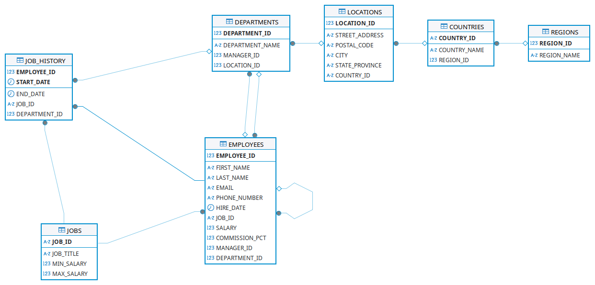

== Schema Description

The Project is inspired by https://github.com/oracle-samples/db-sample-schemas/tree/main[Oracle Sample Database]. This is the description available on Oracle site:

In the Human Resource (HR) records, each employee has an identification number, e-mail address, job identification code, salary, and manager. Some employees earn commissions in addition to their salary.

The company also tracks information about jobs within the organization. Each job has an identification code, job title, and a minimum and maximum salary range for the job. Some employees have been with the company for a long time and have held different positions within the company. When an employee resigns, the duration the employee was working, the job identification number, and the department are recorded.

The sample company is regionally diverse, so it tracks the locations of its warehouses and departments. Each employee is assigned to a department, and each department is identified either by a unique department number or a short name. Each department is associated with one location, and each location has a full address that includes the street name, postal code, city, state or province, and the country code.

In places where the departments and warehouses are located, the company records details such as the country name, currency symbol, currency name, and the region where the country is located geographically.

== DDD

Two kind of people will use the application: HR and Admin.

The Admins can do everything inside the application:

- create/modify a Region, a Country, a Location, a Department, a Job, an Employee
- they can fire an Employee or a Group of Employees (for example closing a department or location)
- they can move a group of Employees between departments
- they can retrieve some data: for example advanced search for employees (even extract a CSV)
- they can retrieve summary data: number of employee currently in the company, the variation of employees
during last year, last three years, also same data but for job type, and department, and country
- they can decide a raise for all jobs

The HR:

- can search employees, insert and modify
- they have information about the variation of employees in the last year, three year
group by job type, country, department etc.
- they have information about turnover rate for every department, location, country etc.
